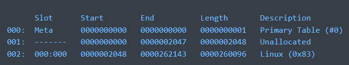

## [Interesting Vulnerabilities](VulnList.md)
## SQL Injection

```sql
' OR 1 = 1 UNION SELECT 1
```
If error:
- Try adding a limit to the amount of Rows
- Try adding more columns

## Web

- Inspect HTML
- Inspect JS
- Inspect Debug tab
- Inspect CSS
- Search for /robots.txt
- If the server is apache, try /.htaccess
- If MacOS: try /.DS_Store

When prompted for a password:

- Try switching request to put or post

##### If () are blocked:  
```javascript
 `${console.log`test`}`
 //instead of
 console.log("test")
 ```
### API
- Check OPTIONS verb
- Try every verb
- Try passing more fields in an "update" endpoint

ex: If the user object is this: 
```json
{
    "username":"username",
    "status":"user"
}
```
and the update endpoint asks for this:
```json
{
    "username":"username"
}
```
Pass this:
```json
{
    "username":"username",
    "status":"admin"
}
```

### Path Traversal

Useful to check:
- admin.php
- login.php
- Add ~ at the end of the php files
    - Vim backup files are stored with the file name + ~
- /etc/apache2/sites-enabled/000-default or /etc/apache2/sites-available/default
### Different Angular XSS payloads
https://github.com/swisskyrepo/PayloadsAllTheThings/blob/master/XSS%20Injection/XSS%20in%20Angular.md
    
### StoredXSS

To try to intercept requests from the page:

https://requestbin.myworkato.com/

Can add link to img src, or change window.location to this and add "?flag=" + document.cookie

### JWT

- https://jwt.io/
- https://github.com/lmammino/jwt-cracker
  - Needed for `crackjwt.sh`
```bash
crackjwt.sh [jwtToken]
```


### Flask session token:
- https://github.com/Paradoxis/Flask-Unsign
  - Needed for `crack_flask_token.sh` and `edit_flask_token.sh`
- https://www.kirsle.net/wizards/flask-session.cgi

```bash
crack_flask_token.sh [token]
```

```bash
edit_flask_token.sh [payload] [secret]
```
## Hashcat

Password bruteforce cracking from a hash: Hashcat

    hashcat -a 0(brute force) -m [n] (n = hash type) file.hash rockyou.txt
    hashcat -a 0(brute force) -m [n] (n = hash type) file.hash rockyou.txt -r oneruletorulethemall.rule

## RSA

https://github.com/RsaCtfTool/RsaCtfTool

    RsaCtfTool.py --decrypt CIPHERTEXT -n N -e E

```python
from Crypto.Util.number import inverse
from Crypto.PublicKey import RSA

key = RSA.importKey(asciikey)
n = int(key.n)
e = int(key.e)
```

## STEG
#### Braille translator:

https://www.branah.com/braille-translator

#### Find hidden msgs in homoglyphs:

    https://holloway.nz/steg/

#### Hidden msgs in plain text:

- Check first word of lines
- Check first letter of line
- Check whitespaces (https://www.dcode.fr/langage-whitespace)

#### Find files hidden in images or more:
binwalk
add `--dd='.*'` or `-Me` to extract

#### Get Metadata:
exiftool for images
pdfinfo for pdfs
strings for text files

#### Get strings from binary files:
strings

nslookup: check open ports
ps: processes

When checking hex, check the begining and the end of the file. Can have some info about the file type.
Files starting with BM are BMP files

check for corrupted images/ find out if there are hidden bytes:

`identify -verbose [image]`

`imganalyzer --image [image] -t jpg --height 3000 --width 3000`

https://georgeom.net/StegOnline/upload

Stegonline: extract bytes from colors
Ex: extract red/green/blue bit 1 from an image
bit 0 or 1 are the least noticeable

## PWN

### C vulnerabilities:

    gets() <-- Reads until newline, can pass in null bytes and its gonna read them

### Heap overflow

    Look for malloc functions
    To overflow: Number of bytes in malloc + 16 (for 64bit otherwise + 8)
    
    ex: AAAAAAAAAAAAAAAAAAAAAAAAAAAAAAAAAAAAAAAAAAAAAAA\x00cat .passwd #
        
        First 48 chars are gonna be in buffer A, the rest is gonna be in buffer B
        
        AAAAAAAAAAAAAAAAAAAAAAAAAAAAAAAAAAAAAAAAAAAAAAA\x00 <- [Buffer A] cat .passwd # <- [Buffer B]

    If need to inject null byte: printf '\x00' 

If we have a shell that does not execute anything:

`(printf 'bufferoverflow' && cat) | ./program`

Adding cat at the end lets us interact with the shell.


## Unix bins that can bypass security stuff
https://gtfobins.github.io/

checksec:
Shows the security information on a file.
useful for pwn challenges 

## Cheatsheets
- https://github.com/Rajchowdhury420/CTF-CheatSheet
- https://github.com/payloadbox/sql-injection-payload-list 

## ASM
https://www.dei.isep.ipp.pt/~nsilva/ensino/ArqC/ArqC1998-1999/nguide/ng-j.htm

#### ASM x86_64 jump instructions

    JA - Jump If Above
    JAE - Jump If Above or Equal
    JB - Jump If Below
    JBE - Jump If Below or Equal
    JC - Jump If Carry
    JCXZ - Jump If CX Register Zero
    JE - Jump If Equal
    JG - Jump If Greater
    JGE - Jump If Greater or Equal
    JL - Jump If Less
    JLE - Jump If Less or Equal
    JMP - Jump Unconditionally
    JNA - Jump If Not Above
    JNAE - Jump If Not Above or Equal
    JNB - Jump If Not Below
    JNBE - Jump If Not Below or Equal
    JNC - Jump If No Carry
    JNE - Jump If Not Equal
    JNG - Jump If Not Greater
    JNGE - Jump If Not Greater or Equal
    JNL - Jump If Not Less
    JNLE - Jump If Not Less or Equal
    JNO - Jump If No Overflow
    JNP - Jump If No Parity
    JNS - Jump If No Sign
    JNZ - Jump If Not Zero
    JO - Jump If Overflow
    JP - Jump If Parity
    JPE - Jump If Parity Even
    JPO - Jump If Parity Odd
    JS - Jump If Sign
    JZ - Jump If Zero

x86_64 Word length:

    word == 16 bits
    dword == double word == 32 bits
    qword == quad word == 64 bits

LEA asm instruction => Load Effective Address

    & => AND
    | => OR
    ^ => XOR
    ~ => NOT

https://stackoverflow.com/questions/43933379/what-do-the-e-and-r-prefixes-stand-for-in-the-names-of-intel-32-bit-and-64-bit-r

| 63 - 32 | 31 - 16 | 15 - 8 | 7 - 0 |
|---------|---------|--------|-------|
|         |         |   AH   |   AL  |
|         |   EAX   |   AX   |       |
|   RAX   |         |        |       |


#### ASM x86_64 syscalls 
https://chromium.googlesource.com/chromiumos/docs/+/master/constants/syscalls.md

ASM x86_64 directives:

https://docs.oracle.com/cd/E26502_01/html/E28388/eoiyg.html

strace: Useful to see the syscalls that a program does.


#### Use python lib pwn to do asm syscalls:

ex:
```py
    p = process("path/to/process")
    context.arch = "amd64"

    code = asm("""
    ...
    """)
    p.sendlineafter("printed text",code)
    p.interactive()
```

##### asm code ex:


rsp == stack pointer

Use pwn to do syscalls:
```py
        p = process("path/to/process")
        context.arch = "amd64"
        code = ""
        code += shellcraft.amd.linux.$1(arg0,...,argN)
        code += shellcraft.amd.mov(reg1,val)
        code += shellcraft.amd.linux.$2(arg0,...,argN)
        code += shellcraft.amd.linux.$3(arg0,...,argN)
        p.sendlineafter("printed text",asm(code))
```
        where $N <-- syscall name(ex: open, read, write)

## Reverse:

    If no idea what to find:

    Check IDA -> Graph view for each functions
    It is possible to draw an image using the graph view


## Linux

Move from ssh to main computer:
```bash
scp -P [PORT] user@host:path /mnt/c/Users/...
```

```bash
sudo -l #list actions that you can do
sudo -u [user] #impersonate user
```

If you are allowed to do a command on a path ending with /*, you can execute it anywhere
    
#### ex:
    
    User x may run the following commands on host_machine:
    /bin/cat /x/public/* 
                       
    this means you can do something like: cat /x/public/../../user2/flag.txt

### SUID exploits

If file permission has: -##s###### (s instead of x for root permission) -> <strong>SUID</strong>

#### 1. Change PATH variable
##### Example:
```bash
ls flag.txt
```
##### Exploit by:
```bash
cp /bin/cat /tmp/ls #if there are arguments after the ls, try using nano instead
export PATH=/tmp 
```

#### File descriptors:
    STDIN = 0
    STDOUT = 1
    STDERR = 2


## Java

    javap.exe to get info on java

## Sleuth

Useful to do forensics on .img/.iso files

#### If we get "Cannot determine file system type"
We need to pass in an offset -> add `-o [offset]` to the command

To get offsets on the image:
`mmls [img]`
Example result: 

To get info on an image:
`fsstat [img]` 

To find a file in the image:
`fls -r [img] | grep [filename]` <-- will give the inode of the file

To read the content of the file:
`icat [img] [inode]`


## Networking

#### Wireshark
    
- Follow stream to read the data sent in one chunk
- `File -> Export Objects -> [Protocol]` To get all the objects sent 

#### Cisco IOS

- username [username] password 7 [password] <--- hashed password is reversable
  - https://packetlife.net/toolbox/type7/ 

## Mobile

#### Flutter RE

https://github.com/Impact-I/reFlutter

## Databases

MSSQL Management Studio allows you to do a vulnerability assessement on a db.
