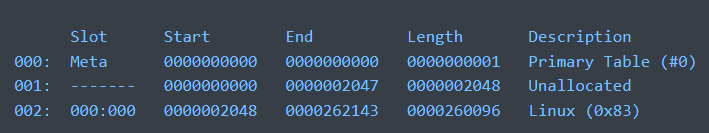

[BACK](../README.md)
# Forensics
## Find strings
- strings [FILE] | grep -Ei '.?f.?l.?a.?g.?-'
  - searches for files with the word flag-
## Rust_file_crawler
`rust_file_crawler.exe [folder] -c`
## Sleuth

Useful to do forensics on .img/.iso files

### If we get "Cannot determine file system type"
We need to pass in an offset -> add `-o [offset]` to the command

To get offsets on the image:
`mmls [img]`
Example result: 

To get info on an image:
`fsstat [img]` 

To find a file in the image:
`fls -r [img] | grep [filename]` <-- will give the inode of the file

To read the content of the file:
`icat [img] [inode]`

### Access Data FTK imager

- Useful to mount images on your computer

### Find a location
- Coords converter:
  -  https://www.earthpoint.us/Convert.aspx

## Image/Firmware

- 2 Types of file systems
  - SquashFS
    - Has a sqashfs-root folder
  - JFFS2
    - Has a jffs2-root folder
- `binwalk -Me` to extract
- .cgi files are executable
  - Can be an ELF file or a shell script
  - Can be interesting to reverse
  - Strings can be useful

## MFT
- https://github.com/rowingdude/analyzeMFT for linux
- Eric Zimmerman's tools for windows

## Volatility
Windows:
- vol -f "[MemoryDump]" -o "[OutFolder]" windows.cmdline
  - Get the command line arguments of all processes
  - equivalent to `ps -ef`
- vol -f "[MemoryDump]" -o "[OutFolder]" windows.pslist
  - Get the list of processes
  - equivalent to `ps aux`
- vol -f "[MemoryDump]" -o "[OutFolder]" windows.filescan
  - Get the list of files
  - useful info: grep Users | grep -v "AppData"
- vol -f "[MemoryDump]" -o "[OutFolder]" windows.dumpfiles.DumpFiles --virtaddr [FileAddr]
  - Dump a file from memory
  - --virtaddr is the address of the file in memory
  - it can be found with the windows.filescan command
  

## TestDisk
- To recover files from a disk img
- testdisk [img]
We can:
- List files on disk
  - includes deleted files
- Copy a file from the disk to our computer