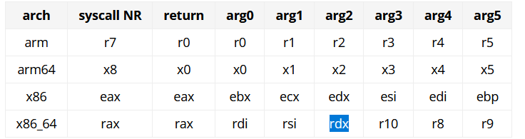
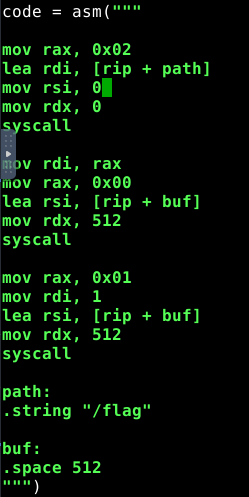

[BACK](../README.md)
# PWN
## Numbers:
- Try negative number
- Try int overflow: 4294967295
- Try long overflow: 18446744073709551615
- Try 0
- Try decimal numbers
## Windows stack:
- Starts at RBP
- Current at RSP
- Goes DOWN
- Return address is there
## Checklist
- file [path]
    - 64 or 32 bit
    - x86_64, Arm, x86?
- checksec
    - check securities on the file

## ELF files
PLT: Procedure linkage table
- Useful for dynamically linked files
- 
### Checksec

RELRO:
- Read Only Relocation
- Moves
## C vulnerabilities:

    gets() <-- Reads until newline, can pass in null bytes and its gonna read them

    printf(to_print) <-- no format specifier given, we can pass our own

## Heap overflow

    Look for malloc functions
    To overflow: Number of bytes in malloc + 16 (for 64bit otherwise + 8)
    
    ex: AAAAAAAAAAAAAAAAAAAAAAAAAAAAAAAAAAAAAAAAAAAAAAA\x00cat .passwd #
        
        First 48 chars are gonna be in buffer A, the rest is gonna be in buffer B
        
        AAAAAAAAAAAAAAAAAAAAAAAAAAAAAAAAAAAAAAAAAAAAAAA\x00 <- [Buffer A] cat .passwd # <- [Buffer B]

    If need to inject null byte: printf '\x00' 

If we have a shell that does not execute anything:

`(printf 'bufferoverflow' && cat) | ./program`

Adding cat at the end lets us interact with the shell.

### Use python lib pwn to do asm syscalls:


https://chromium.googlesource.com/chromiumos/docs/+/master/constants/syscalls.md
ex:
```py
    p = process("path/to/process")
    context.arch = "amd64"

    code = asm("""
    ...
    """)
    p.sendlineafter("printed text",code)
    p.interactive()
```

#### asm code ex:


rsp == stack pointer

Use pwnlib to do syscalls:
```py
        from pwnlib.shellcraft import amd64
        from pwnlib.asm import asm
        p = process("path/to/process")
        context.arch = "amd64"
        code = ""
        code += shellcraft.amd64.linux.$1(arg0,...,argN)
        code += shellcraft.amd64.mov(reg1,val)
        code += shellcraft.amd64.linux.$2(arg0,...,argN)
        code += shellcraft.amd64.linux.$3(arg0,...,argN)
        p.sendlineafter("printed text",asm(code,arch="amd64"))
```
        where $N <-- syscall name(ex: open, read, write)

### Format String vuln

- %08x prints 4 bytes of the stack in big endian format
- %016lx prints 8 bytes of the stack in big endian format
- adding n$ between the % and the format allows to offset by n
- First 6 args are pushed in registers
  - arg 0 = format
  - arg 1-5 = registers
  - arg 6+ = stack
- Leak top of stack = `%6$x`
  - `%7$x, %8$x` for next value on stack etc...
- Leak specific address:
  - decimal(desired_addr - top_of_stack_addr)/8 + 6 = n
  - `%n$lx` to leak address
- Write data:
  - `"A%9$nAAA\0\0\0\0\0\x40\x40\x12" -> A %9$n AAA 0x0000000000404012`
    - Length of input before %n is what is going to be written
    - %9$n means that we are going to write in the pointer located at the 9th arguments position
      - AKA 4th arg on the stack or rsp+0x18
    - AAA is padding to reach the 9th argument
    - 0x0000000000404012 is the address of the pointer we want to write to
      - it is going to be stored at rsp+0x18/4th arg on the stack/%9$
    - Result: We write 1 to the address 0x0000000000404012
    - dynamically find a pointer to write to:
```python
    #Leak a random pointer on the stack, that points to another location on the stack
    sendline("%372$x")
    #Contains the data we leaked.
    #In this case, a random pointer that pointed to somewhere on the stack
    res = readline()
    #Difference between the address we leaked to and the location of the return address on the stack
    offset = 3368
    stack = int(res, 16)
    #Pointer that contains the return address
    return_addr = stack + offset

    #%4200224x %10$n 12 + return_addr
    #%4200224x -> the data we want to write. In this case, the new return address that we want
    #4200224 -> 0x401720 in decimal
    #%4200224x means we add 0x401720 bytes of padding, therefore we write 0x401720 bytes
    #%10$n means that our pointer is located at argument 10, or the 4th arg on the stack
    #12 is just padding to reach the 4th arg position on the stack
    #return address is writen to that position
    fmtstr_payload = b"%4200224x%10$n12"+packing.p64(return_addr)
```

### Endianness:

- ELF: `readelf -h [FILE]`
- PE: Little endian
- Windows ARM: Little endian
- MIPS: Big endian but can support little endian 

### Find function offset:

#### ELF:
- Not stripped
- Func is not static or in annonymous namespace

`get_func_offset.sh [FILE] [FUNC_NAME]`

##### Function Virtual Address (VA):
`readelf -s [FILE] | grep [FUNC_NAME] | grep -o -P "[0-9a-fA-F]{16}"` 

##### .text section Offset:
`readelf -S [FILE] | grep .text | grep -o -P "[0-9a-fA-F]{8}$"`

##### .text section VA:
`objdump -h [FILE] | grep .text | grep -o -P "[0-9a-fA-F]{8}[ ]+[0-9a-f]{16}" | grep -o -P "[0-9a-fA-F]{16}"` 

Fn Offset = fn_VA - .text_VA + .text_Offset

## Shellcode optimisations (amd64):
- Use xor regA,regA -> set 0 
- push 0; pop regA -> same length as xor
- Use xchg to swap registers instead of 2 mov
- push regA pop regB -> less bytes than a mov
- xor regA,regA ; inc regA -> set 1
- Using lower registers (ex: rax -> eax -> al) will give a different bytecode

### Registers prefixes
##### Extended regs(rax):
48 
##### 32 bit regs(eax):
none
##### 16 bit regs(ax)
66
##### 8 bit regs(al/ah)
[decrement op num] 

### Assembly to byte:

xor: [reg prefix] 31 [registers]

mov: [reg prefix] 89 [registers]

### registers:

    (rax,eax,ax):
    al: 0xD8
    ah: 0xDC

    (rdi,edi,di):
    dil: 0xDF
    dih: 0xDE

    (rdx,edx,dx):
    dl: 0xDA
    dh: 0xDF

    (rsi,esi,si):
    sl: 0xDE 
    (no sh)

## ROP:
- Find gadgets:
  - objdump
  - `rp++ --unique -r [gadget_length] -f [file]`
    - length 2 should be good
- Can jump in middle of instruction
- Jumping to leave will move rbp to rbp
- Try building shellcode of what is needed then try to recreate it with gadgets
  - Syscalls are very rare

## Heap exploitation:
### Glibc malloc internals:
- Chunks:
- Each chunk has a header of 16 bytes (on 64bit)
  - Previous size (8 bytes)
  - Size (8 bytes)
  - User data
- When a chunk is freed, the first 16 bytes of user data are used for bookkeeping
  - Forward pointer (8 bytes)
  - Backward pointer (8 bytes)
- When malloc is called, it first checks TCache for available chunks
- If TCache is empty, it checks Fastbins, then Smallbins, then Largebins
- If no suitable chunk is found, it requests more memory from the OS using mmap or sbrk
- Realloc does not use the TCache
### Glibc malloc bins:
#### Tcache bins: 0x20 to 0x410 (16 to 1032 bytes)
- TCache bins are singly linked lists
- Each TCache bin can hold up to 7 chunks
- No coalescing is done on free
- Chunks are not sorted by size
- Bin sizes are aligned to 0x10 so there are bins for 0x20, 0x30, 0x40, ..., 0x410
  - ex: 0x25 bytes requested -> 0x30 bin
- Double free check on every entry
#### Fastbins: 0x20 to 0x70 (16 to 88 bytes)
- Fastbins are singly linked lists
- No coalescing is done on free
- Chunks are not sorted by size
- Double free check only on the first entry
#### Smallbins: 0x80 to 0x400 (128 to 1024 bytes)
- Smallbins are doubly linked lists
- Coalescing is done on free
- Chunks are sorted by size
#### Largebins: > 0x400 ( > 1024 bytes)
- Largebins are doubly linked lists
- Coalescing is done on free
- Chunks are sorted by size
#### Unsorted bin: all sizes
- Unsorted bin is a doubly linked list
- Coalescing is done on free
- Chunks are not sorted by size
- When a chunk is freed, it is first placed in the unsorted bin
- When malloc is called, if no suitable chunk is found in the other bins, the unsorted bin is checked
- If a suitable chunk is found, it is removed from the unsorted bin and placed in the appropriate bin
- If no suitable chunk is found, the next chunk in the unsorted bin is checked
- If no suitable chunk is found in the unsorted bin, more memory is requested from the OS
#### Call order when freeing:
- Tcache -> Fastbin -> Unsorted bin -> Smallbin -> Largebin
#### Call order when allocating:
- Tcache -> Fastbin -> Smallbin -> Largebin -> Unsorted bin

## MISC:
### pthread_getattr_np(pthread_t thread_id, pthread_attr_t *attr):
- Tested for glibc 2.39
- Used to get stack address of thread
- When called, if there is an error, __pthread_attr_destroy is called, and the error code is returned
  - __pthread_attr_destroy frees only attr.extension.cpuset and iattr.extension, without nulling them.
- if we donc check the error code and keep using attr, we have a use after free vuln
#### Links:
- https://elixir.bootlin.com/glibc/glibc-2.39/source/nptl/pthread_attr_destroy.c#L25
- https://elixir.bootlin.com/glibc/glibc-2.39/source/nptl/pthread_attr_setaffinity.c#L45
- https://elixir.bootlin.com/glibc/glibc-2.39/source/nptl/pthread_attr_extension.c#L28
- https://elixir.bootlin.com/glibc/glibc-2.39/source/nptl/pthread_getattr_np.c#L203

#### Ways to make it fail:
- If we have control over thread_id, we can pass an invalid one
- If low memory limits are set, malloc/calloc inside pthread_getattr_np can fail

## FSOP
- Very useful on exiting programs that call fclose on FILE pointers
### VTable overwrite
- The IO_FILE_plus struct has a vtable pointer at the end
- We can make the ptr point to a controlled location and build a fake vtable
- Since libc 2.27, there is a check to see if the vtable pointer is in __libc_IO_vtables or _IO_vtable_check
- To bypass this, we can point the vtable pointer to a location in libc that is in __libc_IO_vtables
### Wide VTable
- if the IO_FILE.mode is > 0, the code paths are a bit different
- There is a way to make the libc use IO_FILE.wide_data.vtable instead of IO_FILE.vtable
- We can then make IO_FILE.wide_data.vtable point to a controlled location
### codecvt
- If the IO_FILE.mode is > 0
- The codecvt facet is used to convert between narrow and wide characters
- IO_FILE has a pointer to the codecvt
- codecvt is a struct, with "__cd_in" and "__cd_out" ptrs, which both contains a "step" ptr, which contains a function ptr