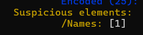
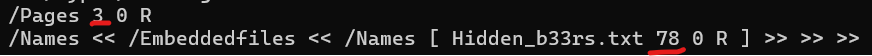

[BACK](../README.md)
# STEG
## If you have 2 texts that seem to contain the same words:

https://github.com/rw/plainsight

```bash
plainsight_decode.sh [ciphertext] [cleartext]
```

## If text looks like a spam mail:

https://spammimic.com/decode_fr.shtml

## Braille translator:

https://www.branah.com/braille-translator
https://abcbraille.com/braille

Layout of a braille character:

1 4
2 5
3 6

Numbers:
Either:
Start with
1 o
2 o
3 6

OR

uses the first letter of the alphabet and adds 

o o
o o
3 o

Grade 1 -> 1 Braille character == 1 character
Grade 2 -> Can use 1 or more character to write a word

## Find hidden msgs in homoglyphs:

    https://holloway.nz/steg/

## Hidden msgs in plain text:

- Check first word of lines
- Check first letter of line
- Check whitespaces (https://www.dcode.fr/langage-whitespace)

## Find files hidden in images or more:
- binwalk
  - add `--dd='.*'` or `-Me` to extract
- steghide


## Audio:
- Audacity
  - Change mode to spectrogram
    - Can show pictures

## Get Metadata:
exiftool for images
pdfinfo for pdfs
strings for text files

## Get strings from binary files:
strings

nslookup: check open ports
ps: processes

When checking hex, check the begining and the end of the file. Can have some info about the file type.
Files starting with BM are BMP files

check for corrupted images/ find out if there are hidden bytes:

`identify -verbose [image]`

`imganalyzer --image [image] -t jpg --height 3000 --width 3000`

https://georgeom.net/StegOnline/upload

Stegonline: extract bytes from colors
Ex: extract red/green/blue bit 1 from an image
bit 0 or 1 are the least noticeable

## APNG files:

- Disassemble and check delays
- Disassemble and check individual frames

To disassemble use apgndis_gui.exe

## If img looks like bad pixel art:
https://www.bertnase.de/npiet/npiet-execute.php

## Extract data from executable:

https://github.com/woodruffw/steg86
install version 0.1.2

`cargo install steg86 --locked --version 0.1.2`

`steg86 extract [FILE] > output`

## PDF:

- peepdf
  - object [object_id] to extract
- Start with the , and continue with the 

## Find code from physical key picture:

https://keysgen.com/?service=keyCode

## QR Codes:
https://medium.com/@MrObvious/what-are-those-other-qr-codes-d4979c7448a

- Different types of codes that look like qr codes:
  - Aztec code
    - Check the center of the code
  - Data Matrix
  
## Punchcards:
- http://laighside.com/punchcard.htm

## Scytale
https://legacy.cryptool.org/en/cto/scytale

- Looks like rot cipher
- Try different turns of band
- try combining rot + scytale
- Similar to rail fence but with straight lines instead of diagonal

## Other

- Music sheet : Velato