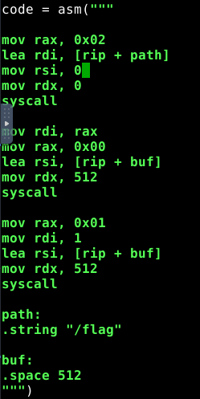

Password bruteforce cracking from a hash: Hashcat

## SQL Injection
Select &**
From 
Where 
UNION

## Hashcat
hashcat -a 0(brute force) -m [n] (n = hash type) file.hash rockyou.txt
hashcat -a 0(brute force) -m [n] (n = hash type) file.hash rockyou.txt -r oneruletorulethemall.rule

## STEG

#### Find files hidden in images or more:
binwalk
add `--dd='.*'` or `-Me` to extract

#### Get Metadata:
exiftool for images
pdfinfo for pdfs
strings for text files

#### Get strings from binary files:
strings

nslookup: check open ports
ps: processes

When checking hex, check the begining and the end of the file. Can have some info about the file type.
Files starting with BM are BMP files

check for corrupted images/ find out if there are hidden bytes:

`identify -verbose [image]`

`imganalyzer --image [image] -t jpg --height 3000 --width 3000`

https://georgeom.net/StegOnline/upload

Stegonline: extract bytes from colors
Ex: extract red/green/blue bit 1 from an image
bit 0 or 1 are the least noticeable

## Unix bins that can bypass security stuff
https://gtfobins.github.io/

checksec:
Shows the security information on a file.
useful for pwn challenges 

## Cheatsheets
- https://github.com/Rajchowdhury420/CTF-CheatSheet
- https://github.com/payloadbox/sql-injection-payload-list 

## ASM
https://www.dei.isep.ipp.pt/~nsilva/ensino/ArqC/ArqC1998-1999/nguide/ng-j.htm

#### ASM x86_64 jump instructions

    JA - Jump If Above
    JAE - Jump If Above or Equal
    JB - Jump If Below
    JBE - Jump If Below or Equal
    JC - Jump If Carry
    JCXZ - Jump If CX Register Zero
    JE - Jump If Equal
    JG - Jump If Greater
    JGE - Jump If Greater or Equal
    JL - Jump If Less
    JLE - Jump If Less or Equal
    JMP - Jump Unconditionally
    JNA - Jump If Not Above
    JNAE - Jump If Not Above or Equal
    JNB - Jump If Not Below
    JNBE - Jump If Not Below or Equal
    JNC - Jump If No Carry
    JNE - Jump If Not Equal
    JNG - Jump If Not Greater
    JNGE - Jump If Not Greater or Equal
    JNL - Jump If Not Less
    JNLE - Jump If Not Less or Equal
    JNO - Jump If No Overflow
    JNP - Jump If No Parity
    JNS - Jump If No Sign
    JNZ - Jump If Not Zero
    JO - Jump If Overflow
    JP - Jump If Parity
    JPE - Jump If Parity Even
    JPO - Jump If Parity Odd
    JS - Jump If Sign
    JZ - Jump If Zero

x86_64 Word length:

    word == 16 bits
    dword == double word == 32 bits
    qword == quad word == 64 bits

LEA asm instruction => Load Effective Address

    & => AND
    | => OR
    ^ => XOR
    ~ => NOT

https://stackoverflow.com/questions/43933379/what-do-the-e-and-r-prefixes-stand-for-in-the-names-of-intel-32-bit-and-64-bit-r

| 63 - 32 | 31 - 16 | 15 - 8 | 7 - 0 |
|---------|---------|--------|-------|
|         |         |   AH   |   AL  |
|         |   EAX   |   AX   |       |
|   RAX   |         |        |       |


#### ASM x86_64 syscalls 
https://chromium.googlesource.com/chromiumos/docs/+/master/constants/syscalls.md
ASM x86_64 directives
https://docs.oracle.com/cd/E26502_01/html/E28388/eoiyg.html
strace: Useful to see the syscalls that a program does.

#### File descriptors:
    STDIN = 0
    STDOUT = 1
    STDERR = 2

#### Use python lib pwn to do asm syscalls:

ex:
```py
    p = process("path/to/process")
    context.arch = "amd64"

    code = asm("""
    ...
    """)
    p.sendlineafter("printed text",code)
    p.interactive()
```

##### asm code ex:


rsp == stack pointer

Use pwn to do syscalls:
```py
        p = process("path/to/process")
        context.arch = "amd64"
        code = ""
        code += shellcraft.amd.linux.$1(arg0,...,argN)
        code += shellcraft.amd.mov(reg1,val)
        code += shellcraft.amd.linux.$2(arg0,...,argN)
        code += shellcraft.amd.linux.$3(arg0,...,argN)
        p.sendlineafter("printed text",asm(code))
```
        where $N <-- syscall name(ex: open, read, write)

## Reverse:

    If no idea what to find:

    Check IDA -> Graph view for each functions
    It is possible to draw an image using the graph view
